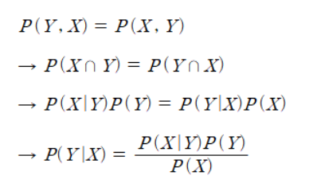

베이즈 정리 수식을 구성하는 확률들에 대해서 알아보겠습니다.

 

P(Y|X) : 사후확률(Posterior)을 뜻합니다. 사후확률이란 사건 발생 후의 확률을 의미하는데, 정확히 말하자면 발생한 사건(X)이 특정 확률분포(Y)에서 나왔을 확률입니다. 머신러닝 관점에서는 관측된 특징(X)이 특정 클래스(Y)에서 나왔을 확률이라고도 할 수 있겠습니다.

 

P(X|Y) : 우도 또는 가능도(Likelihood)를 뜻합니다. 본문에선 우도라는 용어를 사용하겠습니다. 우도란 사후확률과 반대로, 특정 확률분포 or 클래스(Y)에서 특정 사건 or 특징(X)이 발생할 확률을 뜻합니다. 즉, 머신러닝 관점에서는 기존에 있는 데이터의 각 클래스 별로 특정 특징에 대한 분포를 의미합니다.
 

P(Y) : 사전확률(Prior)를 뜻합니다. 특정 특징 or 사건에 무관하게 미리 알 수 있는 확률입니다. 즉, 머신러닝 관점에서는 특징(X)가 관측되기 전부터 이미 정해져있던 클래스(Y)의 분포를 의미합니다.

 

P(X) : 증거(Evidence)를 뜻합니다. 머신러닝 관점에서는 특정 클래스(Y)의 분포에 상관없이 전체 클래스에서 특정 특징(X)이 관측될 확률을 뜻합니다.