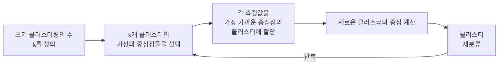

# K Means Clustering (k평균 클러스터링)

## #01. KMeans 개요

### [1] 비지도학습

- 종속변수 없이 컴퓨터가 데이터의 패턴/규칙을 찾아내는 방법
- 분석가의 주관이 많이 반영된다.
- 학습이 끝난 후 평가가 어렵다.

### [2] KMeans 클러스터링

- 각 군집의 평균(mean)을 활용하여 K개의 군집으로 묶는 알고리즘
- 데이터 전처리 단계에서 라벨링을 위해 사용하기도 함.

## #02. KMeans의 수행 절차

### [1] 초기 클러스터링의 수 k를 정의

분석가에 의해서 결정된다. (하이퍼파라미터)

### [2] k개 클러스터의 가상의 중심점들을 선택

### [3] 각 측정값을 가장 가까운 중심점의 클러스터에 할당

### [4] 새로운 클러스터의 중심 계산

### [5] 클러스터 재분류

- 재정의 된 중심값 기준으로 다시 거리기반으로 클러스터링
- 경계가 변경되지 않으면 종료

## #03. KMeans의 수행 방식

#### (1) 모집단 또는 범주에 대한 사전 정보가 없을 때

- 주어진 관측값들 사이의 거리 측정
- 유사성을 이용하여 분석

#### (2) 전체 데이터를 여러 개의 집단으로 그룹화

- 각 집단의 성격 파악
- 데이터 전체의 구조를 이해하기 위함

#### (3) 새로운 데이터와 기존 데이터 간의 유클리디안 거리가 최소가 되도록 클러스터링

- 기존 데이터를 기준점으로 하여 유클리디안 거리 측정
- 거리가 최소화되도록 k개의 군집들로 클러스터링

#### (4) 데이터들을 k개의 클러스터로 군집

- 각 클러스터와 거리 차이의 분산을 최소화
    - 이를 통해 클러스터 내 유사성을 높게 한다.

#### (5) 각 클러스터의 중심값에서 중심과의 거리를 비교

- 각 클러스터 간의 거리 차이의 분산을 최소화
    - 이를 통해 클러스터 간 유사성을 낮게 한다.

## #04. k평균 클러스터링의 특징

### [1] 거리 기반 분류

- 유클리디안 거리의 측정
- 중심점과의 거리 최소화

### [2] 반복 작업

- 초기에 잘못 병합된 경우를 보완함
- 여러 번 반복 수행하여 초기 오류를 회복함
- 여러 번 반복의 결과로 최적의 결과를 만들어 냄

### [3] 짧은 계산 시간

- 간단한 알고리즘으로 계산 시간 최소화
- 대규모 시스템에 적용 가능

### [4] 탐색적 방법

- 새로운 자료에 대한 사전정보가 필요하지 않음
- 자료에 대한 정보 없이도 자료구조 탐색
- 새로운 자료에 대한 탐색을 통해 의미 있는 자료를 찾아냄
- 대용량 데이터에 대한 탐색적인 기법

### [5] 장점

#### 다양한 데이터에 적용

- 거의 모든 형태의 데이터에 대하여 적용 가능
- 관찰할 데이터 간의 거리를 데이터형에 맞게만 정의하면 분석 가능

#### 분석방법의 적용이 쉬움

- 클러스터링 방법은 데이터에 대해 사전정보를 요구하지 않음
- 사전에 특정 변수에 대한 역할 정의가 필요하지 않음
- 관찰할 데이터 간의 거리만이 분석에 필요한 입력값임

### [6] 단점

#### 가중치와 거리 정의 필요

- 관찰할 데이터들 사이의 거리를 정의하는 것의 어려움
- 각 변수에 대한 가중치를 결정하는 것의 어려움

#### 초기 클러스터링 수 결정

- 사전에 정의된 클러스터링 수 k기준으로 찾음
- 초기 설정 클러스터링 수가 적합하지 않으면 결과가 좋지 못함

#### 결과해석이 어려움

- 사전에 주어진 목적이 없어 결과의 해석이 어려움

## #05. k평균 클러스터링 기법

### [1] 초기화 기법

#### 무작위 분할

- 가장 많이 쓰이는 초기화 기법
- 각 데이터들을 임의의 클러스터에 배당함
- 각 클러스터에 배당된 점들의 평균값을 초기값으로 설정
- 데이터 순서에 대해 독립적임
- 각 데이터들에 대해 고르게 분포됨
- 초기 클러스터의 무게중심들이 데이터 집합의 중심에 가깝게 위치하는 경향

#### Forgy

- 1965년 Forgy에 의해 고안
- 데이터 집합으로부터 임의의 k개의 데이터를 선택
- 선택된 k개의 데이터는 각 클러스터의 초기 중심으로 설정
- 데이터 순서에 대해 독립적임
- 각 클러스터의 무게중심이 중심으로부터 퍼져있는 경향 → 초기 클러스터가 임의의 k개의 점들에 의해 설정되기 때문

#### MacQueen

- 1967년 MacQueen에 의해 고안
- 처음 값을 선택하는 것은 Forgy와 동일
- 데이터 집합으로부터 임의의 k개의 데이터를 선택
- 선택된 k개의 데이터는 각 클러스터의 초기 중심으로 설정
- 선택되지 않은 각 데이터들에 대해 가장 가까운 클러스터를 찾아 데이터 배당
- 모든 데이터들이 클러스터에 배당되면 각 클러스터의 무게중심을 다시 계산
- 최종에 가까운 클러스터를 찾는 것은 비교적 빠름
- 최종에 해당하는 클러스터를 찾는 것은 매우 느림

#### Kaufman

- 1990년 Kaufman과 Rousseeuw에 의해 고안
- 전체 데이터 집합 중 가장 중심에 위치한 데이터를첫 번째 중심으로설정
- 선택되지 않은 데이터 집합에 근접하게 위치한 데이터를 새로운 중심으로 설정(가까운 무게중심으로 설정되는 것이 아님)
- 총 k개의 중심이 설정될 때까지 반복
- 무작위 분할과마찬가지로 초기 클러스팅과데이터 순서에비교적 독립적
- 초기 클러스팅과 데이터 순서에 독립적이지 못한 알고리즘보다 월등한 성능

### [2] 클러스터 수의 계산

#### Rule of thumb (경험적 규칙)

- 데이터 포인트의 제곱근을 사용하는 가장 간단한 방법
- 데이터 샘플 크기의 제곱근에 기반하여 시작적으로 클러스터의 수를 추정하는 방법
- 초기 단계에서 클러스터 수를 대략적으로 결정하는 데 유용
- 이 방식은 매우 간단하며 빠르게 클러스터의 대략적인 수를 제공하지만, 모든 상황에 최적이라고 할 수는 없음
- 실제 클러스터링을 수행할 때는 데이터의 구조, 분포, 클러스터링의 목적 등을 고려하여 클러스터의 수를 조정할 필요가 있다.
- Elbow 방법이나 Silhouette 방법과 같이 더 정교한 방법을 사용하여 클러스터의 수를 결정하는 것이 일반적으로 권장된다.

$$
k \approx \sqrt{\frac{n}{2}}
$$

| 값 | 설명 |
|---|---|
| k | 클러스터의 수 |
| n | 데이터 포인트의 총 수 |

#### Elbow

- 클러스터의 수를 순차적으로 늘려가면서 결과를 모니터링
- 하나의 클러스터를 추가했을 때, 이전보다 훨씬 더 나은 결과를 나타내지 않으면 이전의 클러스터의 수를 최종 클러스터의 수로 설정

### 정보 기준 접근법

- 클러스터링 모델에 대해 가능성을 계산하는 방법
- 가능성을 계산할 수 있는 경우에 사용

## #06. k평균 클러스터링의 활용

- 데이터 분류 및 클러스터링 방법으로 활용
- 성향이 불분명한 시장을 분석
- 트렌드와 같이 명확하지 못한 기준을 분석
- 패턴인식, 음성인식의 기본 기술로 활용
- 개체가 불규칙하거나 관련성을 알 수 없는 초기 분류에서 활용

