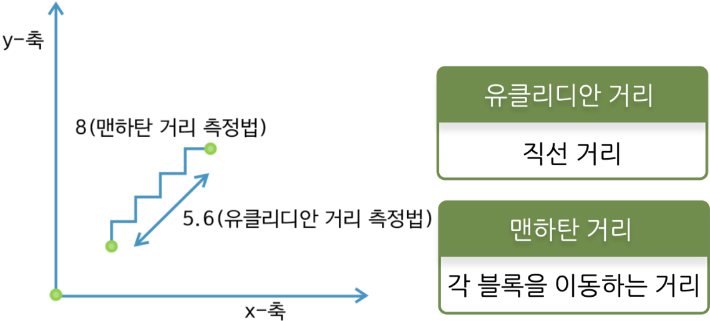
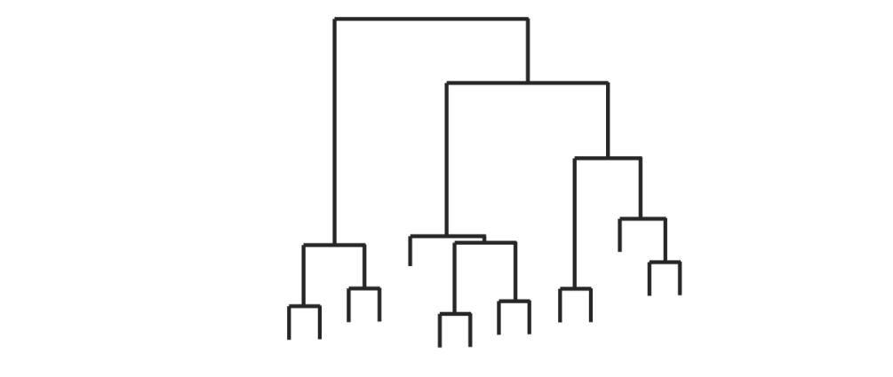
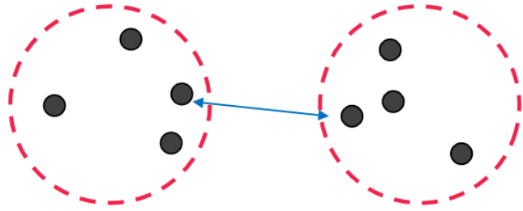
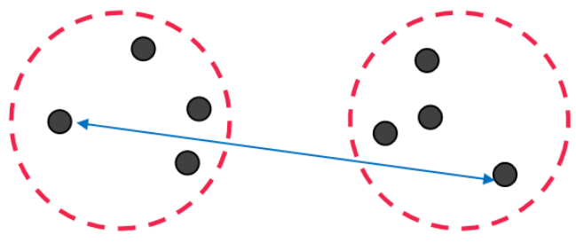
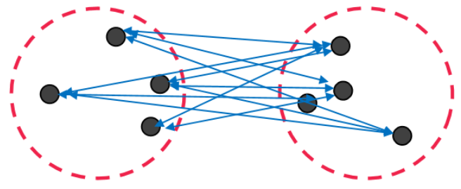
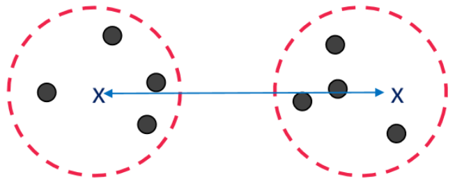
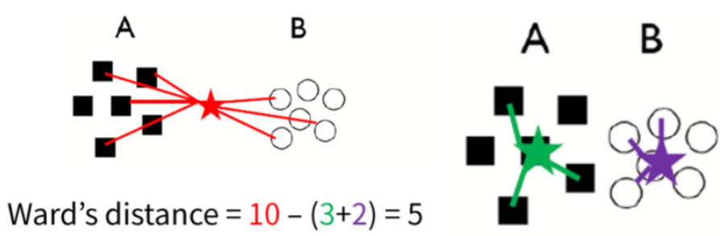

# 계층적 클러스터링 

## #01. 개요

### [1] 계층적 클러스터링이란?

- `데이터와 데이터`, `군집과 데이터`, `군집과 군집`간의 **거리**에 대한 유사도로 군집을 형성
- 고차원 또는 다차원 데이터를 시각화하는 기본적 방법 중 하나
- 사용이 매우 간단함
- 사람이 확인하기 쉬움
    - 방법이 직관적임
    - 고차원의 데이터 셋에서 어떤 일이 일어나는지 빠르게 확인

### [2] 클러스터 접근 절차

- 상향식 접근 방법
- 각 개별 데이터부터 시작
- 주변을 그룹화하여 묶어 나감
- 전체 데이터 세트가 하나의 큰 클러스터 형태로 이루어짐
 

## #02 클러스터 접근 절차의 체크 포인트

### [1] 거리 측정 방식 (metric)

- **서로 가까운 점**끼리 합치는 방식이기 때문에 두 점 사이의 거리를 구하는 방식이 중요함

#### (1) 유클리디안 거리 측정 (Euclidean Distance)

> sklearn 기본값

- 두 점 사이의 거리를 계산할 때 많이 활용되는 방법
- 두 점 상의 직선 상의 거리
- 두 개의 자연수 x와 y의 최대공약수를 계산하는 알고리즘

$$
d(p, q) = \sqrt{(q_1 - p_1)^2 + (q_2 - p_2)^2 + \cdots + (q_n - p_n)^2}
$$

| 값 | 설명 |
|---|---|
| $d(p, q)$ | 두 점 $p$와 $q$사이의 유클리디안 거리 |
| $q_1$, $q_2$, $q_n$ | 각각 점 $p$와 $q$의 좌표 |

#### (2) 멘하탄 거리 측정 (Manhattan Distance)

- 택시 거리라고도 불림
- 뉴욕의 멘하탄에서 실제 이동할 수 있는 거리와 같다고 하여 따온 이름
- 두 점 사이의 거리를 계산할 때 각 좌표 축을 따라 이동한 거리의 총합을 사용
- 두 점 간의 좌표의 차의 절대값으로 간단하게 계산됨
- 그리드 같은 도시에서 두 지점 사이를 이동할 때 실제 이동 경로를 더 잘 반영할 수 있다.

$$
d(p, q) = |q_1 - p_1| + |q_2 - p_2| + \cdots + |q_n - p_n|
$$

| 값 | 설명 |
|---|---|
| $d(p, q)$ | 두 점 $p$와 $q$사이의 멘하탄 거리 |
| $q_1$, $q_2$, $q_n$ | 각각 점 $p$와 $q$의 좌표 |

### [2] 데이터 결합 방식 (linkage)

- 데이터를 병합하는 형태가 군집 결과에 영향을 미치므로 이 과정 역시 중요함
- 데이터를 병합하는 과정은 덴드로그램 형태로 나타남

#### (1) Min(Single Link)

군집과 군집의 거리를 구할 때 가장 최소거리인것을 유사도로 측정하는 방식

#### (2) Max(Complete Link)

군집과 군집의 거리를 구할 때 가장 최대거리인것을 유사도로 측정하는 방식

#### (3) Average Link

군집과 군집의 거리를 구할 때 거리의 평균을 구해 유사도로 측정하는 방식

#### (4) Centroids

> sklearn은 이 방식을 지원하지 않음

군집과 군집의 거리를 구할 때 데이터의 중심점 거리를 유사도로 측정하는 방식

#### (5) Ward

> sklearn 기본값

두개의 군집이 병합되었을 때 증가하는 변동성의 양으로 유사도를 측정하는 방식

#### 변동성

두 군집의 중앙값과 두 군집에 있는 모든 데이터와의 거리의 합에서 군집간에 형성되는 거리를 뺀 값

결국은 병합되는 클러스터의 분산을 최소화 한다는 의미.